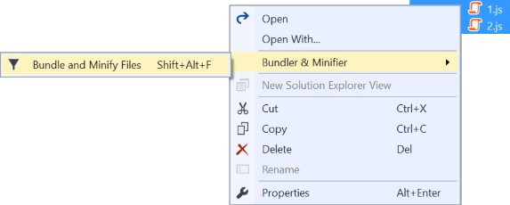
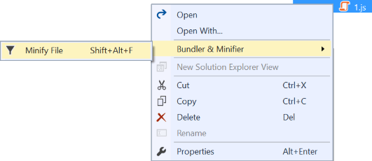

## Bundler and Minifier

A Visual Studio extension that let's you configure bundling and 
minification of JS, CSS and HTML files.

[](https://ci.appveyor.com/project/madskristensen/bundlerminifier)

Download the extension at the
[VS Gallery](https://visualstudiogallery.msdn.microsoft.com/9ec27da7-e24b-4d56-8064-fd7e88ac1c40)
or get the
[nightly build](http://vsixgallery.com/extension/a0ae318b-4f07-4f71-93cb-f21d3f03c6d3/)

### Bundling

Select 2 or more of the same type of files in Solution Explorer
to create a bundle.



Any edits being made to the source files will instantly produce
updated bundle file output.

The bundle configuration is stored in a file called `bundleconfig.json`
which gets added to the root of the project.

### Minification

Minify any JS, CSS or HTML file by right-clicking it in Solution
Explorer. That will create a `<filename>.min.<ext>` and nest
it under the original file.



When the original file is modified, a new min file is produced
instantly.

### bundleconfig.json

The extension adds a `bundleconfig.json` file at the root of the
project which is used to configure all bundling.

Here's an example of what that file looks like:

```js
[
	{
		"outputFileName": "output/bundle.css",
		"inputFiles": [
			"input/file1.css",
			"input/file2.css"
		],
		"minify": false,
		"includeInProject": true
	},
	{
		"outputFileName": "output/bundle.js",
		"inputFiles": [
			"input/file1.js",
			"input/file2.js"
		],
		"minify": true,
		"includeInProject": true
	}
]
```